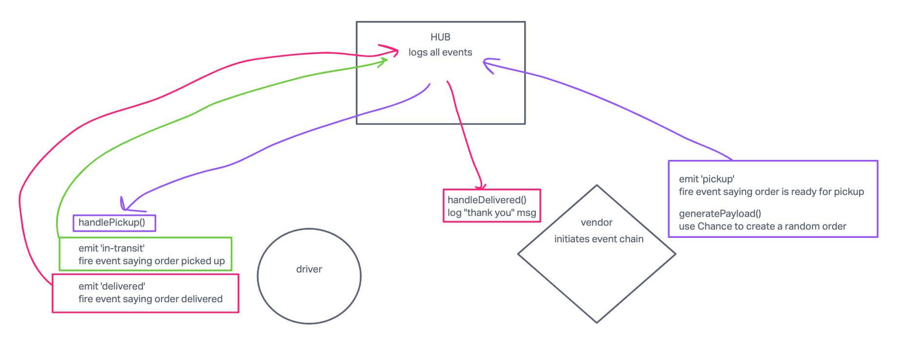

# CAPS: Code Academy Parcel Service

## CAPS Phase 3 Messages - New Pull Request

Continue working on a multi-day build of our delivery tracking system, creating an event observable over a network with Socket.io.

In this phase, we’ll be moving away from using Node Events for managing a pool of events, instead refactoring to using the Socket.io libraries. This allows communication between Server and Client applications.

The intent here is to build the data services that would drive a suite of applications where we can see pickups and deliveries in real-time.

## Whiteboard

Create a UML diagram of the CAPS system on a whiteboard before you start.

Create a new repository for this project, called 'caps' and work in a branch called 'events'.

## Business Requirements

Refer to the CAPS System Overview for a complete review of the application, including Business and Technical requirements along with the development roadmap.

## Phase 2 Requirements

In Phase 2, we’ll be changing the underlying networking implementation of our CAPS system from using node events to using a library called Socket.io so that clients can communicate over a network. Socket.io manages the connection pool for us, making broadcasting much easier to operate, and works well both on the terminal (between servers) and with web clients.

The core functionality we’ve already built remains the same. The difference in this phase is that we’ll be creating a networking layer. As such, the user stories that speak to application functionality remain unchanged, but our developer story changes to reflect the work needed for refactoring.

### User Stories

As a vendor, I want to alert the system when I have a package to be picked up.
As a driver, I want to be notified when there is a package to be delivered.
As a driver, I want to alert the system when I have picked up a package and it is in transit.
As a driver, I want to alert the system when a package has been delivered.
As a vendor, I want to be notified when my package has been delivered.
And as developers, here is our updated story relevant to the above.

As a developer, I want to create network event driven system using Socket.io so that I can write code that responds to events originating from both servers and client applications

## Technical Requirements / Notes

### Overview

The goal of this lab is to create a namespaced Socket.io event server, and to configure Vendor and Driver Client Modules.

- The Socket Server will create a namespace of caps that will receive all CAPS event traffic.
- Each Vendor and Driver Client will connect to the caps namespace.
- The server will emit specific events to each socket that is listening for their designated events from the Global Event Pool defined in the Server.
- Each Vendor will only emit and listen for specific events based on their Vendor ID. This will be managed by rooms within Socket.io.
- Each Driver will “pick up” a package when the vendor notifies the Server that an “order” is ready and simulate “in-transit” and “delivered” events.
- The expected output of the 3 running applications is the same as it was in Phase 2.

### Proposed File Structure

├── .github
│   ├── workflows
│   │   └── node.yml
├── driver
│   ├── handler.js
│   ├── index.js
│   └── driver-handler.test.js
├── vendor
│   ├── handler.js
│   ├── index.js
│   └── vendor-handler.test.js
├── .eslintrc.json
├── .gitignore
├── eventPool.js.
├── hub.js.
├── package.json
└── README.md

### Create the CAPS system as follows

#### Global Event Pool (HUB)

1. Use the socket.io npm package to configure an event Server that can be started at a designated port using node.
  a. Accept connections on a namespace called caps, and configure socket objects from clients.
  b. Ensure that client sockets are connecting to their appropriate room if specified.
2. Configure a Global Event Pool that every client socket should listen for:
  a. pickup - this will be broadcast to all sockets except the sender.
  b. in-transit - this will be emitted only to Vendors that have joined the appropriate room.
  c. delivered - this will be be emitted only to Vendors that have joined the appropriate room.

NOTE: You may need to create an extra event here that allows clients to join rooms.

#### Vendor Client Application

1. Connects to the CAPS Application Server using socket.io-client:
  a. Make sure your module connects to the caps namespace.
  b. Use the store name 1-206-flowers to simulate a single vendor
  c. Upon connection, use the store name as a vendor id to join a room.
2. Upon connection, simulate new customer orders:
  a. Create a payload object with your store name, order id, customer name, and address.
  b. Emit that message to the CAPS server with an event called pickup.
  c. Emit in a setInterval() to simulate multiple orders and observe system functionality.
3. Listen for the delivered event coming in from the CAPS server.
  a. Console log: Thank you for your order <customer-name>.
4. Optionally, you can exit the application using process.exit() or clearInterval(<interval-id>) within a setTimeout() to simulate multiple orders and then stop.

#### Driver Client Application

1. Connects to the CAPS Application Server using socket.io-client:
  a. Make sure this module connects to the caps namespace.
2. Once connected, the Driver client module should listen for any appropriate events from the Server:
  a. When a pickup is emitted from the Server, simulate all specified Driver behaviors.
3. Simulate the following events and emit payloads to the CAPS Application Server upon receiving a “pickup” event:
  a. in-transit
    a. Log “picking up payload.id” to the console.
    b. emit an in-transit event to the CAPS server with the payload.
  b. delivered
    a. emit a delivered event to the CAPS server with the payload.

When running, the vendor and driver consoles should show their own logs. Additionally, the CAPS server should be logging everything.

### Testing

- Write unit tests for each event handler function (not event triggers themselves).
- Use jest spies and/or mock functionality to assert that your handlers were called and ran as expected.
- For our use case, was console.log() and .emit() called with the expected arguments?
